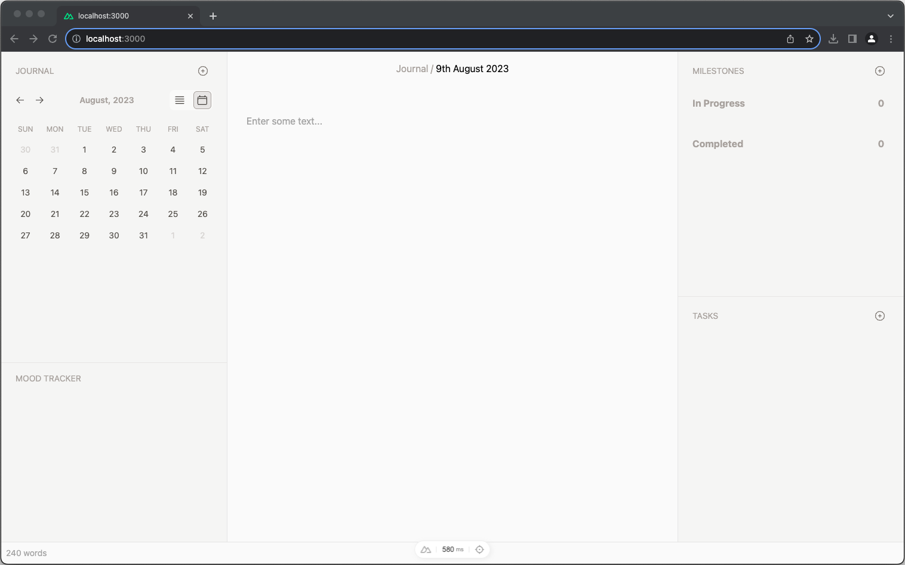

# StudentLife

StudentLife is an open and free study journaling app that helps students find balance in life. StudentLife aims to help students find balance in life by providing a platform for them to reflect on their daily study activities and emotions, as well as intuitive task management based on milestones.



## Development Guide

You will need the following:

- [Node.js](https://nodejs.org/en/download/) (v16 or newer)

Recommended to use [nvm](https://github.com/nvm-sh/nvm) to manage your Node.js versions.

To install nvm, run:

> Mac (with homebrew)

```bash
brew install nvm
```

> Windows (with chocolatey)

```bash
choco install nvm
```

To install Node.js v16 with nvm, run:

```bash
nvm install 16
```

To use Node.js v16 with nvm, run:

```bash
nvm use 16
```

Make sure to install the dependencies:

```bash
# npm
npm install
```

Start the development server on `http://localhost:3000`:

```bash
# npm
npm run dev
```

## Tests

We use [Playwright](https://playwright.dev/) for e2e testing:

- `npm run test:e2e` runs tests and exit
- `npm run test:e2e:ui` opens a [browser UI](https://playwright.dev/docs/test-ui-mode) in watch mode for exploring and
  re-running tests. It's suitable when writing tests.

Make sure you execute these commands before running tests:

- `npx playwright install` - install Playwright browsers
- `cp .env.test.example .env.test`

For macOS need `timeout` utils for scripts:

- `brew install coreutils`

## Prisma Schema Migration

This project uses [Prisma](https://www.prisma.io) ORM.

All schemas are defined in `prisma/schema.prisma`. Refer to [Prisma Schema – Data Model](https://www.prisma.io/docs/concepts/components/prisma-schema/data-model) for more information.

To start up Prisma Studio, run:

> Prisma Studio is a visual editor for the data in your database.

```bash
npx prisma studio
```

To apply schema changes, run:

```bash
npx prisma migrate dev
```

To generate and apply new migration after you change your schema, run:

```bash
npx prisma migrate dev --name <migration-name>
```

You can also pass in `--create-only` flag to only generate migration without applying it.

## Deployment

Build the application for production:

```bash
# npm
npm run build
```

Locally preview production build:

```bash
# npm
npm run preview
```

Check out the [deployment documentation](https://nuxt.com/docs/getting-started/deployment) for more information.

### Deploy with Docker Compose

The compose file defines the main application service `student-life-nuxt` along with three dependent services:

- `mysql`: provides a MySQL database server instance.
- `s3`: provides an AWS S3 compatible MinIO object storage server instance.
- `minioclient`: runs MinIO Client (mc) commands for setting up an object bucket and access policy for the app.

Before running the whole application stack using the following command:

- Please copy `docker.env.example` file to a new one named `docker.env` and change its values suitable for your environment.
- Make sure the exposed ports are not already being in use on the host.

```
$ docker compose -f ./docker-compose.full.yaml up -d
```

There should be three containers running and the port mapping as below:

```
$ docker compose ps
NAME                               IMAGE                                      COMMAND                  SERVICE             CREATED             STATUS                    PORTS
student-life-mysql-1               mysql:8.0.30                               "docker-entrypoint.s…"   mysql               27 minutes ago      Up 27 minutes (healthy)   0.0.0.0:3306->3306/tcp, 33060/tcp
student-life-s3-1                  minio/minio:RELEASE.2023-07-07T07-13-57Z   "sh -c 'minio server…"   s3                  27 minutes ago      Up 27 minutes (healthy)   0.0.0.0:9000-9001->9000-9001/tcp
student-life-student-life-nuxt-1   uolstudentlife/student-life:latest         "node /app/.output/s…"   student-life-nuxt   27 minutes ago      Up 27 minutes             0.0.0.0:3000->80/tcp
```

After the application starts, navigate to `http://localhost:3000` in your web browser.

You also might want to build the application image locally rather than pulling a pre-built one from Docker Hub registry:

```
$ docker compose -f ./docker-compose.full.yaml up -d --build
```

For supporting local development, we provide `docker-compose.yaml` without the main application service included.

To clean up, stop and remove the containers

```
$ docker compose down
```
